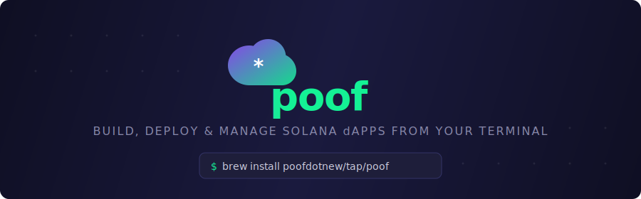

<p align="center">
  
</p>

<p align="center">
  <a href="https://github.com/poofdotnew/poof-cli/releases/latest"></a>
  <a href="https://github.com/poofdotnew/poof-cli/actions/workflows/ci.yml"></a>
  <a href="https://github.com/poofdotnew/poof-cli/blob/main/LICENSE"></a>
  <a href="https://goreportcard.com/report/github.com/poofdotnew/poof-cli"></a>
</p>

# poof

A command-line tool for building, deploying, and managing Solana dApps on [poof.new](https://poof.new).

Single binary. No Node.js. No browser. All Poof platform operations from your terminal.

## Install

**Homebrew:**

```bash
brew install poofdotnew/tap/poof
```

**Go:**

```bash
go install github.com/poofdotnew/poof-cli/cmd/poof@latest
```

**From source:**

```bash
git clone https://github.com/poofdotnew/poof-cli.git
cd poof-cli
make install
```

**Download binary:**

Grab the latest release from [GitHub Releases](https://github.com/poofdotnew/poof-cli/releases) for your platform.

**Update:**

```bash
poof update         # install the latest release
poof update --check # check without installing
```

## Quick Start

```bash
# 1. Generate a Solana keypair
poof keygen
# Output:
#   SOLANA_PRIVATE_KEY=...
#   SOLANA_WALLET_ADDRESS=...

# 2. Save to .env
poof keygen >> .env

# 3. Authenticate
poof auth login

# 4. Build a dApp
poof build -m "Build a token-gated voting app with Solana wallet auth"

# 5. Iterate on it
poof iterate -p <project-id> -m "Add a leaderboard page"

# 6. Deploy to mainnet preview
poof ship -p <project-id>
```

## Configuration

The CLI reads configuration from (highest priority first):

1. **CLI flags** (`--project`, `--env`, `--json`)
2. **Environment variables** (`SOLANA_PRIVATE_KEY`, `POOF_ENV`, etc.)
3. **`.env` file** in the current directory
4. **`~/.poof/config.yaml`** for persistent settings

### Required Environment Variables

| Variable                | Description                       |
| ----------------------- | --------------------------------- |
| `SOLANA_PRIVATE_KEY`    | Base58-encoded Solana private key |
| `SOLANA_WALLET_ADDRESS` | Solana wallet public address      |

### Optional Environment Variables

| Variable              | Default      | Description                                      |
| --------------------- | ------------ | ------------------------------------------------ |
| `POOF_ENV`            | `production` | Environment: `production`, `staging`, or `local` |
| `VERCEL_BYPASS_TOKEN` |              | Vercel protection bypass for staging             |
| `POOF_NO_UPDATE_CHECK` |              | Set to `1` to disable automatic update checks    |

### Persistent Config

```bash
poof config set default_project_id <your-project-id>
poof config set environment staging
poof config show
```

Config is stored at `~/.poof/config.yaml`.

## Commands

### Composite Commands (Workflows)

These chain multiple operations together with polling and progress display.

#### `poof build` — Create and build a project

```bash
poof build -m "Build a todo app with Solana wallet auth"
poof build -m "NFT marketplace" --mode policy --public=false
poof build -m "Match this UI" --file screenshot.png
poof build -m "Mirror both designs" --file page1.png --file page2.png
```

Creates a project, waits for the AI to finish building, and prints the project ID plus any currently known URLs. For automation, trust `poof project status -p <id> --json | jq '.publishState.draft.deployed'` as the draft-deployment signal rather than assuming the presence of a draft URL means it is already serving traffic.

When `--file` is provided, the CLI uploads each image to Poof's global storage first and embeds the resulting `<userUploadedFile>` URLs into the initial build prompt, so the image is part of the AI's very first message (not a follow-up). Supported formats: PNG, JPEG, GIF, WebP (max 3.4MB each).

**Flags:**

| Flag            | Default    | Description                                                      |
| --------------- | ---------- | ---------------------------------------------------------------- |
| `-m, --message` | (required) | What to build                                                    |
| `--mode`        | `full`     | Generation mode: `full`, `policy`, `ui,policy`, `backend,policy` |
| `--public`      | `true`     | Make project publicly visible                                    |
| `--stdin`       | `false`    | Read message from stdin                                          |
| `--file`        | (none)     | Image file(s) to attach (repeatable, PNG/JPEG/GIF/WebP, ≤3.4MB)  |

#### `poof iterate` — Chat and check results

```bash
poof iterate -p <id> -m "Add dark mode support"
poof iterate -p <id> -m "Fix the login button styling"
```

Sends a chat message, waits for the AI to finish, and shows test results if any exist.

If `poof task test-results -p <id> --json` comes back with `summary.total = 0`, inspect `poof task list -p <id> --json`, `poof chat active -p <id> --json`, `poof logs -p <id>`, and `poof project messages -p <id> --limit 100 --json` before assuming the run is healthy. `task list` shows checkpoints/tasks, but test-tool activity may only be visible in project messages until structured execution records land. When `chat active` stays `true` but there are no new task ids or recent logs, clear the stale state with `poof chat cancel -p <id>` and do one targeted retry instead of stacking generic `iterate` calls. If the AI keeps resuming a broken Claude Code context after cancellation or a targeted retry, run `poof chat clear -p <id>` to drop the saved session ID before the next retry. If the task list still only shows bootstrap/constants work and that targeted retry also returns an empty summary, treat the run as a Poof execution incident, capture `poof project status` plus smoke evidence, and stop retrying blindly.

#### `poof verify` — Run the canonical post-build verification flow

```bash
poof verify -p <id>
poof verify -p <id> --json
poof verify -p <id> --skip-url-probe
poof verify -p <id> -m "Run the existing tests, do not generate new ones"
```

Sends the canonical lifecycle + UI verification prompt, waits for the AI, and checks
that fresh test results were produced and all of them passed. Unlike `poof iterate`,
verify is strict about evidence: it snapshots existing test result IDs first and only
counts results created during this run, and exits non-zero if no fresh results appeared
or any fresh result failed. Also probes the draft URL by default.

| Flag                | Default      | Description                                                  |
| ------------------- | ------------ | ------------------------------------------------------------ |
| `-m, --message`     | (canonical)  | Override the canonical verification prompt                   |
| `--skip-url-probe`  | `false`      | Skip the draft URL HEAD probe                                |

#### `poof doctor` — Read-only project health check

```bash
poof doctor -p <id>
poof doctor -p <id> --json
poof doctor -p <id> --skip-url-probe
poof doctor -p <id> --task-limit 25
```

Aggregates everything an agent typically needs to decide what to do next: project
status, publish state for every target, AI active state, the most recent project
tasks, latest test results summary, and a HEAD probe of the draft URL. doctor never
sends chat messages and never modifies project state. The `verdict` field folds the
report into one keyword (`healthy`, `deployed_without_tests`,
`deployed_with_test_failures`, `ai_running`, `deploy_pending`, `incomplete`,
`unknown`) for branching in scripts.

| Flag                | Default | Description                                  |
| ------------------- | ------- | -------------------------------------------- |
| `--skip-url-probe`  | `false` | Skip the draft URL HEAD probe                |
| `--task-limit`      | `10`    | How many recent tasks to include             |

#### `poof ship` — Scan, check, and deploy

```bash
poof ship -p <id>                                 # deploy to preview (default)
poof ship -p <id> -t production --yes             # deploy to production
poof ship -p <id> -t mobile --platform ios --app-name "My App" --app-icon-url https://...
poof ship -p <id> --dry-run                       # scan + check without deploying
```

Runs a security scan, checks publish eligibility, and deploys.

### Project Management

```bash
poof project list                              # list all projects
poof project create -m "Build a ..."           # create a project
poof project status -p <id>                    # get status, URLs, deploy info
poof project messages -p <id>                  # view conversation history
poof project update -p <id> --title "My App"   # update metadata
poof project delete -p <id> --yes               # delete (irreversible)
```

### AI Chat

```bash
poof chat send -p <id> -m "Add a settings page"   # send a message
poof chat active -p <id>                           # check if AI is running, queued, or idle
poof chat steer -p <id> -m "Focus on backend"      # redirect mid-build
poof chat cancel -p <id>                           # cancel current build
poof chat clear -p <id>                            # clear saved AI session context
```

### Files

```bash
poof files get -p <id>                                    # path listing with usage hint
poof files get -p <id> --list                             # paths only, no contents
poof files get -p <id> --stat                             # paths + byte counts
poof files get -p <id> --path "src/**/*.tsx"              # glob-filter; prints contents in text mode
poof files get -p <id> --path "HomePage.tsx"              # bare filename; prints contents in text mode
poof files get -p <id> --json                             # full project dump as JSON (paid)
poof files update -p <id> --file src/config.ts --content "export const X = 1;"
poof files update -p <id> --from-json files.json          # bulk update from JSON
```

### Data (runtime reads/writes)

Talk to a project's Tarobase data plane from the CLI — single writes, atomic `setMany` bundles, reads, and policy queries. The CLI signs + submits offchain transactions for draft and real Solana versioned transactions for mainnet (via Helius); no separate SDK setup needed.

**Project ID vs appId.** A Poof *project ID* (`-p <id>`) is your handle on a project — it owns builds, deploys, settings. A Tarobase *appId* is the data-plane address of a specific deployed policy instance. **Each project has multiple appIds — one per environment** (draft = off-chain / Poofnet, preview and production = real Solana mainnet), so the instances stay cleanly separated. Most commands take `-p` and auto-resolve the right appId from the project's connectionInfo. You can skip that with `--app-id <id> --chain offchain|mainnet` to talk to an appId directly — useful when pointing at a *shared primitives library* someone else has deployed (no Poof-project access needed; auth is still your own wallet). List a project's appIds per env with `poof data app-ids -p <id>`.

```bash
# List a project's appIds per env
poof data app-ids -p <id>
# → project <id>
#     draft      appId=... chain=offchain
#     preview    appId=... chain=mainnet
#     production appId=... chain=mainnet

# Queries (project-based, -e defaults to draft)
poof data query -p <id> --name getSolPriceInUSD
poof data query -p <id> --name getSolBalance --args '{"address":"<addr>"}'

# Same query via shared-appid mode (point at someone else's deployed policy)
poof data query --app-id <appId> --chain offchain --name getSolPriceInUSD

# Single-doc writes + reads
poof data set -p <id> --path "memories/<addr>" --data '{"content":"hi"}'
poof data get -p <id> --path "memories/<addr>"

# Atomic setMany bundle (any rule/hook failure rolls back the whole bundle)
cat > bundle.json <<'EOF'
[
  {"path":"user/<addr>/TimeWindow/g1","document":{"startTime":0,"endTime":4102444800}},
  {"path":"user/<addr>/BalanceCheck/g1","document":{"mint":"<mint>","op":"gte","threshold":0}}
]
EOF
poof data set-many -p <id> --from-json bundle.json

# Mainnet preview via project lookup
poof data set -p <id> -e preview \
    --path "user/<addr>/TokenTransfer/tt-1" \
    --data '{"source":"<addr>","destination":"<addr>","mint":"<usdc>","amount":1}'

# Same write against a shared-appid mainnet instance (no project access needed)
poof data set --app-id <appId> --chain mainnet \
    --path "user/<addr>/TokenTransfer/tt-1" \
    --data '{"source":"<addr>","destination":"<addr>","mint":"<usdc>","amount":1}'
```

Override the Solana mainnet RPC with `POOF_SOLANA_MAINNET_RPC` if you're routing through your own node. See `docs/set-many.md` for composition patterns and failure semantics.

### Deployment

```bash
poof deploy check -p <id>                          # check publish eligibility
poof deploy preview -p <id>                        # deploy to mainnet preview
poof deploy production -p <id> --yes               # deploy to production
poof deploy mobile -p <id> --platform ios --app-name "My App" --app-icon-url https://...
poof deploy static -p <id> --archive dist.tar.gz   # draft only (mainnet-preview/production via `poof deploy preview` / `poof deploy production`)
poof deploy download -p <id>           # start code export
poof deploy download-url -p <id> --task <taskId>   # get download link
```

### Tasks and Testing

```bash
poof task list -p <id>                 # list the newest 20 project tasks
poof task list -p <id> --change-id latest  # inspect only the latest change
poof task get <taskId> -p <id>         # get task details
poof task test-results -p <id>         # view structured test results (latest run per file)
poof task test-results -p <id> --history  # include older runs that have been superseded
```

### Credits

```bash
poof credits balance                   # check credit balance
poof credits topup --quantity 5        # buy credits via x402 USDC
```

### Security

```bash
poof security scan -p <id>            # initiate scan, return immediately
poof security scan -p <id> --wait     # block until scan finishes, show findings
```

### Secrets

```bash
poof secrets get -p <id>                                       # list required/optional secrets
poof secrets get -p <id> --environment production              # filter by environment
poof secrets set -p <id> API_KEY=sk-123 DB_URL=postgres://...  # set secret values
```

### Custom Domains

```bash
poof domain list -p <id>                        # list domains (paid)
poof domain add myapp.com -p <id>               # add domain (paid)
poof domain add myapp.com -p <id> --default     # set as default
```

### Logs

```bash
poof logs -p <id>                              # get runtime logs
poof logs -p <id> --environment preview        # filter by environment
poof logs -p <id> --limit 50                   # limit entries
```

### Templates

```bash
poof template list                             # browse all templates
poof template list --category defi             # filter by category
poof template list --search "nft"              # search
```

### AI Preferences

```bash
poof preferences get                                       # view model tiers
poof preferences set mainChat=genius codingAgent=smart     # update tiers (paid)
```

### Authentication

```bash
poof auth login            # authenticate and cache token
poof auth status           # check token validity
poof auth logout           # clear cached credentials
```

### Browser

```bash
poof browser               # generate a sign-in link for poof.new using your CLI session
poof browser --env staging # sign-in link for staging
```

### Utilities

```bash
poof keygen                # generate a new Solana keypair
poof config show           # show current configuration
poof config set <key> <val>  # set a config value
poof version               # show version, commit, build date
poof update                # update poof to the latest release
poof update --check        # check for updates without installing
```

### Shell Completion

```bash
poof completion bash       # generate bash completion script
poof completion zsh        # generate zsh completion script
poof completion fish       # generate fish completion script
poof completion powershell # generate PowerShell completion script
```

## Global Flags

These flags work with every command:

| Flag                 | Description                                        |
| -------------------- | -------------------------------------------------- |
| `-p, --project <id>` | Project ID (or set `default_project_id` in config) |
| `--env <name>`       | Environment: `production`, `staging`, `local`      |
| `--json`             | Output as JSON (for scripting)                     |
| `--quiet`            | Minimal output (IDs and URLs only)                 |
| `--no-update-check`  | Skip the automatic update check                    |

## Output Formats

```bash
# Human-readable (default)
poof project list

# JSON (for scripting and piping)
poof project list --json
poof project list --json | jq '.projects[].id'

# Quiet (just essential values)
poof project list --quiet
```

## Environments

| Environment  | Base URL                      | Use case            |
| ------------ | ----------------------------- | ------------------- |
| `production` | `https://poof.new`            | Live apps (default) |
| `staging`    | `https://v2-staging.poof.new` | Testing             |
| `local`      | `http://localhost:3000`       | Local development   |

Switch environments:

```bash
poof --env staging project list
POOF_ENV=staging poof project list
poof config set environment staging
```

## Generation Modes

Control what Poof generates when creating a project:

| Mode             | What's generated                     | Use case                                |
| ---------------- | ------------------------------------ | --------------------------------------- |
| `full`           | UI + backend + policies + deployment | Turnkey Poof-hosted app                 |
| `policy`         | Database policies + typed SDK only   | You build your own frontend and backend |
| `ui,policy`      | Frontend + policies                  | You build your own backend              |
| `backend,policy` | Backend API + policies               | You build your own frontend             |

```bash
poof build -m "Token trading platform" --mode full
poof build -m "Manage my data" --mode policy
```

## Scripting Examples

**Build and get the draft URL:**

```bash
URL=$(poof build -m "Build a voting app" --json | jq -r '.urls.draft')
echo "Draft: $URL"
```

**Check if AI is done:**

```bash
if poof chat active -p $ID --json | jq -e '.active' > /dev/null; then
  echo "Still building..."
else
  echo "Done!"
fi
```

**Full CI/CD pipeline:**

```bash
#!/bin/bash
set -e

# Build
PROJECT=$(poof build -m "Build a staking dashboard" --json | jq -r '.projectId')

# Test
poof iterate -p $PROJECT -m "Generate and run lifecycle tests for all policies"

# Check results
FAILED=$(poof task test-results -p $PROJECT --json | jq '.summary.failed')
if [ "$FAILED" -gt 0 ]; then
  echo "Tests failed!"
  exit 1
fi

# Ship
poof ship -p $PROJECT -t preview
```

## Credits

- Free tier: ~10 daily credits (resets daily)
- `poof credits balance` is free and shows your balance
- Deployment, file access, and custom domains require a credit purchase
- `poof credits topup` initiates the x402 USDC payment flow

## Development

```bash
git clone https://github.com/poofdotnew/poof-cli.git
cd poof-cli

make build          # build binary to bin/poof
make test           # run tests with race detector
make lint           # run golangci-lint
make lint-fix       # run golangci-lint with auto-fix
make fmt            # format all Go files
make vet            # run go vet
make coverage       # run tests and open HTML coverage report
make coverage-text  # print coverage summary to terminal
make all            # lint + test + build
make release        # cross-compile for all platforms
make install        # install to $GOPATH/bin
```

### Prerequisites

- **Go 1.26+**
- **[golangci-lint](https://golangci-lint.run/welcome/install/)** for `make lint`:
  ```bash
  go install github.com/golangci/golangci-lint/cmd/golangci-lint@latest
  ```

### CI/CD

CI runs automatically on every push to `main` and on pull requests:

- **Lint** — golangci-lint (errcheck, staticcheck, govet, misspell, gofmt, and more)
- **Test** — `go test -race` with coverage reporting
- **Build** — verifies the binary compiles and runs

See [`.github/workflows/ci.yml`](.github/workflows/ci.yml) for details.

### Releasing

Releases are automated with [GoReleaser](https://goreleaser.com/) via GitHub Actions.

**To create a release:**

```bash
git tag v0.1.0
git push origin v0.1.0
```

This triggers the [release workflow](.github/workflows/release.yml) which:

1. Runs `go mod tidy` and `go test ./...`
2. Cross-compiles for macOS (arm64/amd64), Linux (arm64/amd64), and Windows (amd64)
3. Creates archives (tar.gz for Unix, zip for Windows) with checksums
4. Publishes a GitHub Release with auto-generated changelog
5. Pushes a Homebrew formula to [`poofdotnew/homebrew-tap`](https://github.com/poofdotnew/homebrew-tap)

### Homebrew Tap Setup

To enable `brew install poofdotnew/tap/poof`, the following one-time setup is needed:

1. **Create the tap repository** at [github.com/poofdotnew/homebrew-tap](https://github.com/poofdotnew/homebrew-tap) (empty repo, just needs to exist)
2. **Create a Personal Access Token** with `repo` scope that has push access to `poofdotnew/homebrew-tap`
3. **Add the token as a repository secret** in `poofdotnew/poof-cli` → Settings → Secrets → Actions → New secret:
   - Name: `HOMEBREW_TAP_TOKEN`
   - Value: the PAT from step 2
4. **Tag and push** a release — GoReleaser will automatically push the formula

Once configured, users can install with:

```bash
brew install poofdotnew/tap/poof
```

## License

[MIT](LICENSE)
